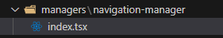

# Building Block Code for micro frontend
# HostApp
The purpose of this project is host all micro frontends that will build all the app.

## MicroFronteds Supported

|App | Port | ID DOM |
|----|-------| ------ |
|personalLoginApp|9001|appPersonalLogin-mfe|
|companyLoginApp|9002 |appCompanyLogin-mfe|
|internetBankingMenuApp|9003|appInternetBanking-mfe| 
|personalDashboardApp|9004 |appPersonalDashboard-mfe|
|companyDashboardApp|9005 |appCompanyDashboard-mfe|

# Instructions to prepare and add your microfrontend in the host
To prepare your microfrontend app you will need follow the next instructions:

-  Add a bootstrap.tsx file in the root folder
    - The code of bootstrap.tsx should contain the following code
    ```javascript
    import React from "react";
    import { createRoot } from "react-dom/client";
    import { RouterProvider } from "react-router-dom";
    import { createRouter } from "./routing/router-factory";
    import { RoutingStrategy } from "./routing/types";
    import "./index.css";

    const mount = ({
      mountPoint,
      initialPathname,
      routingStrategy,
    }: {
      mountPoint: HTMLElement;
      initialPathname?: string;
      routingStrategy?: RoutingStrategy;
    }) => {
      const router = createRouter({ strategy: routingStrategy, initialPathname });
      const root = createRoot(mountPoint);
      root.render(<RouterProvider router={router} />);

      return () => queueMicrotask(() => root.unmount());
    };

    export { mount };
    ```
- Change your index.tsx for index.ts and add the following code structure
```javascript
import('./bootstrap').then(
    ({ mount }) => {
      const localRoot = document.getElementById('appLanding-mfe'); 
  
      mount({
        mountPoint: localRoot!,
        routingStrategy: 'browser',
      });
    }
  );
  
  export {};
```
- Take care with the line 3, in the instruction     
``` javascript 
  document.getElementById('appLanding-mfe');
```
-You will need look the right id of the container in the file related with your microfrontend or in the **MicroFronteds Supported** section.


- Add a routing folder with the following files
  - router-factory.ts: _Build a new router_
      - ``` javascript
        import { createBrowserRouter, createMemoryRouter } from "react-router-dom";
        import { routes } from "./routes";
        import { RoutingStrategy } from "./types";

        interface CreateRouterProps {
          strategy?: RoutingStrategy;
          initialPathname?: string;
        }

        export function createRouter({ strategy, initialPathname }: CreateRouterProps) {
          if (strategy === 'browser') {
            return createBrowserRouter(routes);
          }

          const initialEntries = [initialPathname || "/"];
          return createMemoryRouter(routes, { initialEntries: initialEntries });
        }
        ```
  - routes.tsx : _Here you can add all the routes that your microfroned need use_
      - ``` javascript
        import React from 'react';
        import { Outlet } from "react-router-dom";
        import { Main } from '../components/pages/main';
        import { NavigationManager } from '../components/managers/navigation-manager';


        export const routes = [
          {
            path: "/",
            element: (
              <NavigationManager>
                <Outlet />
              </NavigationManager>
            ),
            children: [
              {
                index: true,
                element: <Main />,
              },
              {
                path: "main",
                element: <Main />,
              }
            ],
          },
        ];
        ```
  - types.ts
      - ```javascript
        export type RoutingStrategy = 'memory' | 'browser';
        ```
- Create a new **managers** folder and inside create a **navigation-manager** folder that should contain a React component 

  - This component is in charge to manage the navigation in your microfrontend that manage that since HostApp
  ```javascript
    import React, { ReactElement, useEffect } from 'react';
    import { matchRoutes, useLocation, useNavigate } from 'react-router-dom';
    import { routes } from '../../../routing/routes';

    interface NavigationManagerProps {
      children: ReactElement;
    }

    export function NavigationManager({ children }: NavigationManagerProps) {
      const location = useLocation();
      const navigate = useNavigate();

      useEffect(() => {
        function hostNavigationHandler(event: Event) {
          const pathname = (event as CustomEvent<string>).detail;
          if (location.pathname === pathname || !matchRoutes(routes, { pathname })) {
            return;
          }
          navigate(pathname);
        }

        window.addEventListener("[host] navigated", hostNavigationHandler);

        return () => {
          window.removeEventListener("[host] navigated", hostNavigationHandler);
        };
      }, [location]);

      useEffect(() => {
        window.dispatchEvent(
          new CustomEvent("[landingApp] navigated", { detail: location.pathname })
        );
      }, [location]);

      return children;
    }	
  ```

- That should be that for the microfrontend, run and execute.

- Follow the next example if you have doubts about the microfrontend configuration for this project.

